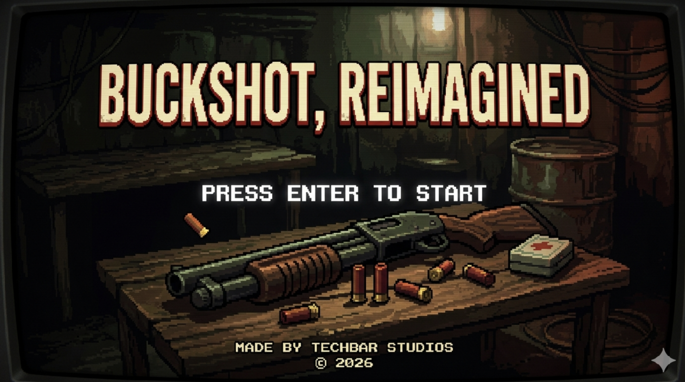
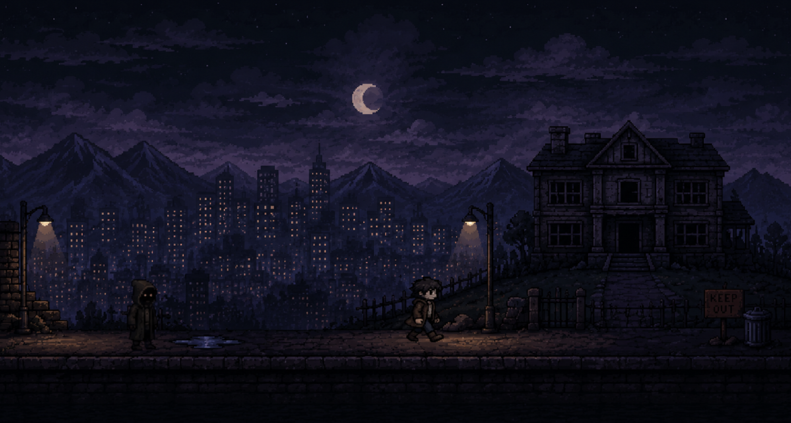
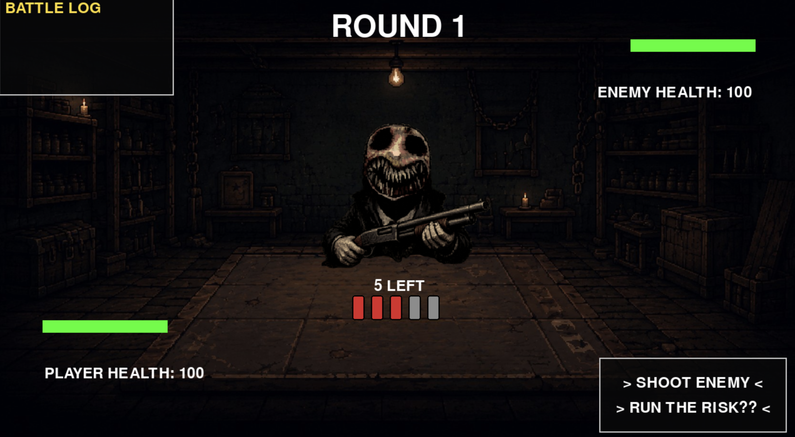
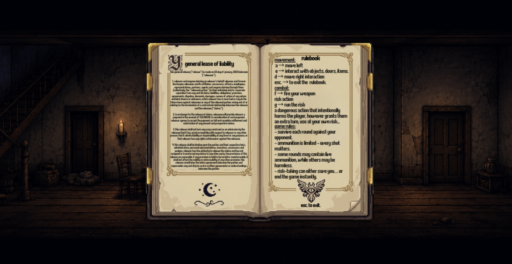

# Buckshot Platformer

*A simplified platformer take on **Buckshot Roulette** — built from scratch in Python by one very determined non-artist.*

## 🎮 About

*Buckshot Platformer* (title screen name: **Buckshot, Reimagined**) drags the tense, high-stakes gamble of Buckshot Roulette into a 2D pixel-art world. Explore a moody night-time cityscape, face off against a shotgun-wielding nightmare fuel of an enemy, and make choices like *"SHOOT ENEMY"* or *"RUN THE RISK??"* — because apparently regular combat wasn't stressful enough.

Every design decision, every line of code, every questionable life choice in this project was made by me. The only AI involvement? The sprites — because I am many things, but an artist is not one of them. 🎨❌

## ✨ Features

- **2D platforming movement** — run through atmospheric, pixel-art night scenes
- **Turn-based shotgun combat** — face the enemy across the table with live and blank rounds ("5 LEFT"... but *which* 5?)
- **The Risk Action** — a dangerous move that deliberately harms YOU, but grants an extra turn. High risk, questionable reward
- **In-game rulebook** — press a key and the whole manual opens up in a fancy book. Fancy!
- **Battle log** — because every near-death experience deserves a paper trail
- **Player & enemy health bars** — watch your life flash before your eyes in convenient green-bar form

## 🕹️ Controls

| Key | Action |
| --- | --- |
| `ENTER` | Start the game |
| `A` | Move left |
| `D` | Move right |
| `E` | Interact with objects, doors, items |
| `F` | Fire your weapon |
| `G` | **Run the Risk** — intentionally harms you, but grants an extra turn. Use at your own risk... obviously |
| `ESC` | Exit the rulebook |

## 🚀 Getting Started

### Prerequisites

- Python 3.x installed on your machine

### Installation

```bash
# Clone the repository
git clone https://github.com/your-username/buckshot-platformer.git
cd buckshot-platformer

# (Optional) Create a virtual environment
python -m venv venv
source venv/bin/activate      # On Windows: venv\Scripts\activate

# Install the one and only dependency
pip install pygame
```

### Running the Game

```bash
python main.py
```

> ⚠️ Replace `main.py` with the actual entry-point file name of your project.

## 📸 Screenshots

### Title Screen



### Platformer Gameplay



### Combat — Round 1



### In-Game Rulebook



## 🎨 A Note on the Art (Full Transparency)

**All code, game design, and suffering: 100% human-made (me).**
**Most/all sprites and artwork: AI-generated.**

I want to be completely upfront about this — I made this entire game myself, but since my artistic ability peaked at stick figures, the visuals were generated with AI. The gameplay, mechanics, code, and every decision behind them are all mine. Consider the AI my unpaid art intern. 🤖🖌️

## 🗂️ Project Structure

```javascript
buckshot-platformer/
├── main.py            # Game entry point
├── ...                # Game modules / assets
├── screenshots/       # Screenshots used in this README
└── README.md
```

## 🛠️ Built With

- **Python** — core game logic
- **Pygame** — rendering, input handling, and all things game-y *(installed via pip)*
- **`os` & `random`** — Python's standard library, for file paths and a healthy dose of chaos (respectively)

## 🤝 Contributing

Contributions, issues, and feature requests are welcome! Feel free to fork the project and submit a pull request.

## 📜 License

This project is licensed under the MIT License — see the [LICENSE](LICENSE) file for details.

---

*Made by Techbar Studios (My old minecraft username, this isn't an actual studio lol). A fan-made homage to Buckshot Roulette — not affiliated with the original game.*

TLDR: Buckshot roulette platformer, works on both windows and mac, made in python enjoy 😄